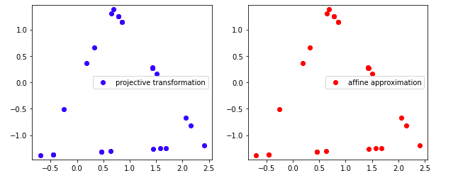

## Приближение проективного преобразования аффинным – отчет

### Введение

#### Проективное преобразование

Проективное преобразование — это взаимно-однозначное отображение проективного пространства на себя, сохраняющее отношение порядка частично упорядоченного множества всех подпространств. Определяющим свойством проективного преобразования является сохранение двойного отношения.
Проективное преобразование является взаимно однозначным отображением множества точек проективной плоскости, а также является взаимно однозначным отображением множества прямых. Тем не менее в отличие от аффинного преобразования, проективное преобразование в общем случае не обязано сохранять отношение параллельности прямых

#### Аффинное преобразование
Аффи́нное преобразование – частный случай проективного преобразования, отображение плоскости или пространства в себя, при котором параллельные прямые переходят в параллельные прямые, пересекающиеся — в пересекающиеся, скрещивающиеся — в скрещивающиеся

#### Проведенные тесты и иные сопроводительные материалы
В данной работе предлагается аппроксимировать некоторое проективное преобразование аффинным. В соответсвующем репозитории Вы найдете реализацию функций класса `Homograph` для генерации точек, задания проективного преобразования и приближающего аффинного преобразования. Все данные используемые данные были взяты из вывода в консоль файла `main.cpp` из директории `prj.test`

Файл `main.cpp`, визуализация эксперимента в блокноте `.ipynb` а также полученные результаты в `.txt` доступны [по ссылке](https://gitlab.com/nickgor0303/gorbachev_n_m/-/tree/master/prj.test/Homography).
Реализацию методов Вы можете найти [здесь](https://gitlab.com/nickgor0303/gorbachev_n_m/-/tree/master/prj.lab/Homography).

### Ход работы
#### Генерация точек

Воспользовавшись методом `makeTriangle` из `main.cpp` зададим нормально распределенное множество точек по периметру треугольника. В среде colab отрисуем данное множество, сохраненное в файле `source.txt`.

#### Дисторция точек

С помощью метода `transformProjectively()` получим матрицу случайного проективного преобразования с произвольно заданным поворотом, масштабом и также переносом с отличным значением от [0,0,1] характерного для аффинного параллельного переноса (эффект дисторции).

Полученной матрицей преобразуем все точки треугольника внутри функции `main.cpp`, затем отрисуем результат в colab.

#### Приближенное аффинное преобразование 

Посредством метода `approximate()` приблизим данное проективное преобразование композицией аффинных. Метод `approximate()` основан на сингулярном разложении (метод `bdcSvd()` класса `Eigen`)

Полученной матрицей преобразуем все точки треугольника внутри функции `main.cpp`, затем отрисуем результат в colab.
Сравнивая значения полученные при проективном и аффинном преобразованиях (в файлах `distorted.txt` и `approximate.txt`) видно, что результирующие точки совпадают, покажем это наглядно:

### Вывод 

Так, мы видим, что проективное преобразование с высокой точностью можно аппроксимировать композицией аффинных преобразований, чтд.

