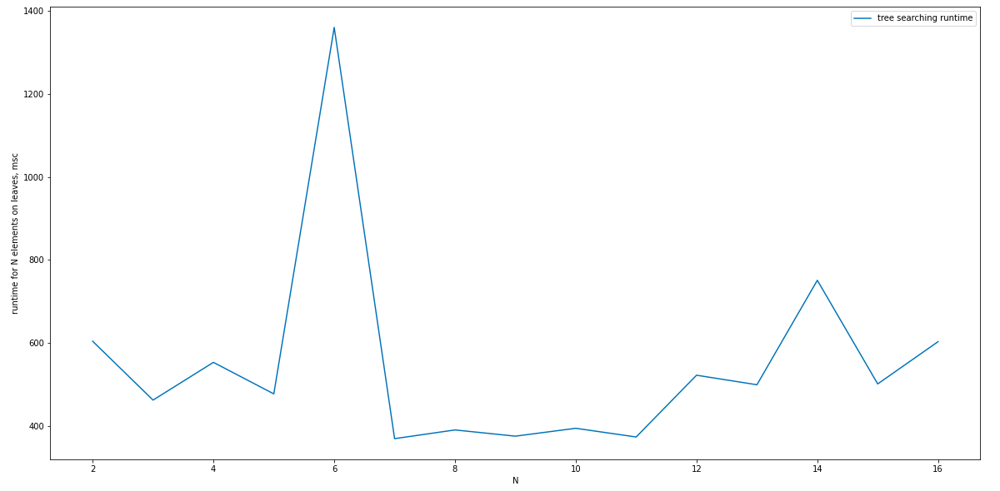
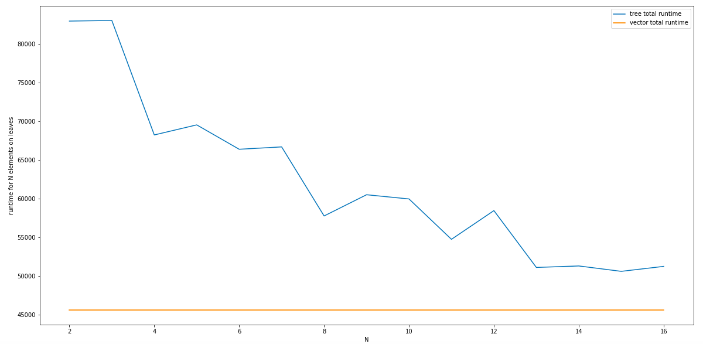
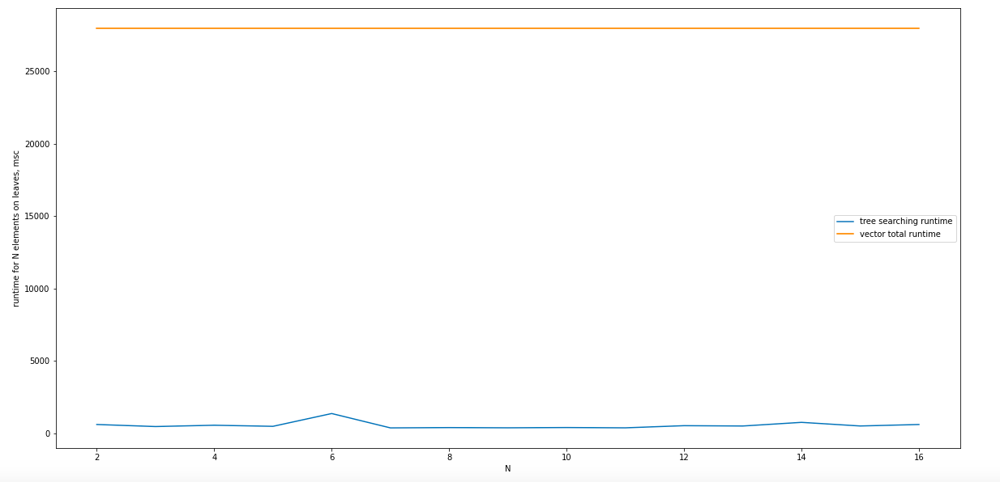

## KDTree как структура быстрого поиска данных – отчет

### Введение

#### Быстрый поиск данных

Во многих современных прикладных областях, таких как распознавание образов, компьютерное зрение, базы данных итд, на сегодняшний день актуальна проблема быстрого поиска данных. Последний может представлять из себя, например, т. н. `knn-search` – поиск ближайших `k` соседей объекта в некотором метрическом пространстве с известным параметром `k` и неизвестным радиусом поиска, или т. н. `range searching`, в случае которого, наоборот, известен радиус поиска объектов около заданного при и неизвестно количество результирующих объектов. 

#### KD-дерево
KD-дерево (KDTree) – это структура данных с разбиением пространства для упорядочивания точек в k-мерном пространстве, служащая для решения задач быстрого поиска данных. Далее под задачей (быстрого) поиска будет подразумеваться `knn-search`, частный случай применения KD-дерева. KD-дерево по сути представляет из себя двоичное дерево поиска, экстраполированное на многомерные пространства. 

В данной лабораторной рассмотрены построение дерева KDTree, поиск данных с помощью дерева поиска, а также поиск, частично использующий дерево, и частично – простой перебор.

#### Проведенные тесты и иные сопроводительные материалы
В этой директории приведены тесты для структуры данных **KD-дерево**, к которым мы будем отсылать на протяжении отчета. 
В файле `main.cpp` Вы найдете тест, в котором сравнивается скорость работы KD-дерева со скоростью перебора используя `std::vector`. В последней версии реализации тесты происходят в функции `test3()`.

### Принцип работы KD-дерева
#### Общее описание
Как было сказано выше, KD-дерево представляет из себя двоичное дерево поиска для многомерных метрических пространств. На каждом листе такого дерева содержится `n`-мерная точка, или набор из `m` таких точек (параметр `m` задается произвольно как количество желаемых точек ближайших к данной). 
Каждая вершина помимо листовых, содержит информацию о разделении пространства на две части (полупространства) гиперплоскостью. Так, точки слева от данной плоскости соответствуют левому поддереву KD-дерева, и точки справа – правому. Существуют различные подходы к выбору ориентации гиперплоскости в пространстве, и записи информации в нодах дерева, тем не менее каждая нода всегда содержит информацию о направлении плоскости (т.е. нормали плоскости) и информацию о том, какие из точек попадают в какое полупространство. 

Выше проиллюстрирован пример построения KD-дерева для трехмерного пространства. Первое разделение (красной вертикальной плоскостью) делит исходную белую клетку на две подклетки: затем каждая из них делится (зелеными горизонтальными плоскостями) на два подклетки каждая. Наконец, четыре клетки делятся синими вертикальными плоскостями напополам. Далее разделение невозможно, поэтому финальные восемь клеток обозначаются как листовые клетки.

#### Устройство дерева в данной работе
В данной работе приведено построение и работа дерева в трехмерном пространстве для решения задачи `knn-search`. Направления разрезов в данной работе предлагается выбирать вдоль координат, с каждой итерацией меняя направление (вдоль `oX`, `oY`, `oZ`). Так, каждой ноде (кроме листовых), соответствует номер координаты (i от 0 до 3), и координаты точки, по которой происходит разрез. Далее для каждого из "дочерних" полупространств в качестве точки следующего разреза выбирается средняя по координате i точка. 

С подробным устройством дерева Вы можете знакомиться в каталоге с реализацией последнего: `../../prj.lab/KDTree/`

#### Поиск по дереву 
Итак, теоретически поиск по KD-дереву занимает O(logn) где n количество точек среди которых выполняется поиск. Такая ассимптотика следует из построение дерева: на n точек в пространстве придется поредка logn уровней дерева (количество разделений) при нормальном распределении точек по осям. Кроме того, мы можем ожидать от поведения дерева резкое замедление (вплоть до O(n), т.е. полного перебора) в зависимости от распределения точек вдоль одной конкретной оси в большей степени чем вдоль других. Наконец, при увеличении числа `m` в два раза мы можем ожидать уменьшение времени работы в порядка двух раз, так как это увеличение означает остановку построения дерева на один уровень выше, то есть охват половины точек. 

С подробным устройством, а также реализацией дерева Вы можете ознакомиться в каталоге `../../prj.lab/KDTree/`

### Проведение эксперимента
#### Общие сведения

В данной работе предлагается сравнить скорость работы дерева со скоростью простого перебора для в задаче поиска ближайшего соседа. Данное сравнение производится в функции `test3()`, реализованной в `main.cpp`. Далее предлагается ознакомиться с работой упомянутой функции

#### Работа тестовой функции test3()

В этой функции создается вектор типа `std::vector<Point>`на 100000 элементов. Затем производятся измерения времени поиска `bruteForceDuration` конкретной точки посредством перебора всех точек.
Далее, для `i = [1..16]` точек, сохраняющихся на листовых нодах дерева, производится создание соответствующего KD-дерева и поиск в нем:

– `KDTree treeI(std::begin(points), std::end(points), i);`

– `Point kN = treeI.kClosestPoints({9, 2, 1}, i);`

Для каждой из этих операций производятся замеры времени. Для большей точности все вычисления проводятся `j = 10` раз, и затем результаты усредняются.

#### Полученные резуьтаты

Результаты всех замеров времени выводятся в консоль и в текстовый файл:
`std::ofstream outputFile("data.txt", std::ofstream::binary);`

Результаты замеров времени для каждого `i` в сравнении с результатом простого перебора приведены в графиках ниже. Приведенные графики построены по выходным данном описанной функции.

 

Приведенный выше график иллюстрирует зависимость времени поиска по KD-дереву от количества m листовых точек. Из графика видно, что в среднем время поиска (нахождение m целевых точек вдоль дерева и перебор этих m точек) падает до `m = 11`, что может объясняться спусканием вдольдерева на меньшую глубину. Далее время начинает увеличиваться, что объяснимо превалированием времени перебора в листовых нодах над временем поиска по дереву. 

Кроме того, мы наблюдаем аномальное поведение дерева для `m = 6` и `m = 14`. Такое поведение (а именно неожиданное увеличение времени работы) может быть следствием неравномерного распределения точек по осям координат, что может привести к увеличению количества перебираемых вершин в зависимости от момента остановки процесса деления пространства на подпространства. 

 

На графике выше мы можем наблюдать зависимость времени суммарной работы (построения и поиска) KD-дерева в сравнении с суммарным временем работы перебора среди вектора точек (заполнение и собственно перебор). Данный график действительно имеет признаки обратной пропорцинальности (что отвечает теоретическому прогнозу), с учетом повышения времени работы для нечетного числа листовых вершин. Факт того что с повышением числа вершин в `x` раз время работы падает менее чем в `x` раз снова может объясняться неравномерным распределением тестовых точек вдоль осей координат. 

 

На данном графике мы можем наглядно видеть выгоду использования KD дерева, поиск по которому работает более чем в 25 раз быстрее чем простой перебор даже при некоторых обстоятельствах, замедляющих бинарный поиск, таких как неравномерное распределение координат точек вдоль осей.

### Вывод 

В данной работе мы познакомились с реализацией структуры данных KD-дерево и рассмотрели ее применение на практике в задаче поиска ближайшего соседа. Эксперимент показал, что поиск по дереву действительно эффективнее простого перебора на несколько порядков, что подтверждает актуальность использования KD-дерева как поисковой структуры.

Кроме того, было установлено, что распределение точек в зависимости от осей координат может играть заметную роль при некоторых конкретных реализациях дерева, и может повлечь несущественные в сравнении с простым перебором, однако ощутимые, изменения времени работы.

Наконец, были изучена изучена зависимость времени работы KD-дерева от количество точек, содержащихся на его листах. Опыт показал, что данная зависимость сильно зависит от природы распределения точек, однако в среднем время работы падает при увеличении числа листовых точек до тех пор, пока перебор среди листовых точек не начинает занимать большую часть времени. 