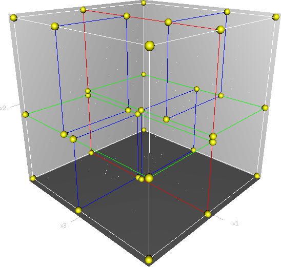

## KDTree как структура быстрого поиска данных – отчет

### Введение

#### Быстрый поиск данных

Во многих современных прикладных областях, таких как распознавание образов, компьютерное зрение, базы данных итд, на сегодняшний день актуальна проблема быстрого поиска данных. Последний может представлять из себя, например, т. н. `knn-search` – поиск ближайших `k` соседей объекта в некотором метрическом пространстве с известным параметром `k` и неизвестным радиусом поиска, или т. н. `range searching`, в случае которого, наоборот, известен радиус поиска объектов около заданного при и неизвестно количество результирующих объектов. 

#### KD-дерево
KD-дерево (KDTree) – это структура данных с разбиением пространства для упорядочивания точек в k-мерном пространстве, служащая для решения задач быстрого поиска данных. Далее под задачей (быстрого) поиска будет подразумеваться `knn-search`, частный случай применения KD-дерева. KD-дерево по сути представляет из себя двоичное дерево поиска, экстраполированное на многомерные пространства. 

В данной лабораторной рассмотрены построение дерева KDTree, поиск данных с помощью дерева поиска, а также поиск, частично использующий дерево, и частично – простой перебор.

#### Проведенные тесты и иные сопроводительные материалы
В этой директории приведены тесты для структуры данных **KD-дерево**, к которым мы будем отсылать на протяжении отчета. 
В файле `main.cpp` Вы найдете тест, в котором сравнивается скорость работы KD-дерева со скоростью перебора используя `std::vector`. В последней версии реализации тесты происходят в функции `test3()`.

### Принцип работы KD-дерева
Как было сказано выше, KD-дерево представляет из себя двоичное дерево поиска для многомерных метрических пространств. 

#### Работа тестовой функции test3()

В этой функции создается вектор типа `std::vector<Point>`на 100000 элементов. Затем производятся измерения времени поиска `bruteForceDuration` конкретной точки посредством перебора всех точек.
Далее, для `i = [1..16]` точек, сохраняющихся на листовых нодах дерева, производится создание соответствующего KD-дерева и поиск в нем:

– `KDTree treeI(std::begin(points), std::end(points), i);`

– `Point kN = treeI.kClosestPoints({9, 2, 1}, i);`

Для каждой из этих операций производятся замеры времени. Для большей точности все вычисления проводятся `j = 10` раз, и затем результаты усредняются.

#### Полученные резуьтаты

Результаты всех замеров времени выводятся в консоль и в текстовый файл:
`std::ofstream outputFile("data.txt", std::ofstream::binary);`

Результаты замеров времени для каждого `i` в сравнении с результатом простого перебора приведены в графиках каталоге `plots`. Приведенные графики построены по выходным данном описанной функции.
