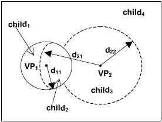

## VPTree как структура быстрого поиска данных – отчет

### Введение

#### Быстрый поиск данных

Во многих современных прикладных областях, таких как распознавание образов, компьютерное зрение, базы данных итд, на сегодняшний день актуальна проблема быстрого поиска данных. Последний может представлять из себя, например, т. н. `knn-search` – поиск ближайших `k` соседей объекта в некотором метрическом пространстве с известным параметром `k` и неизвестным радиусом поиска, или т. н. `range searching`, в случае которого, наоборот, известен радиус поиска объектов около заданного при и неизвестно количество результирующих объектов. 

#### VP-дерево
VP-дерево (VPTree) – это структура данных с разбиением пространства для упорядочивания точек в k-мерном пространстве, служащая для решения задач быстрого поиска данных. Далее под задачей (быстрого) поиска будет подразумеваться `knn-search`, частный случай применения VP-дерева. VPTree по сути представляет из себя метрическое дерево, которое разделяет данные в метрическом пространстве, выбирая позицию в пространстве ("точка обзора") и разделяя точки данных на две части: те точки, которые ближе к точке обзора, чем пороговое значение, и те точки, которые дальше.

В данной лабораторной рассмотрены построение VP-дерева, а также поиск данных с помощью дерева в сравнении с простым перебором данных. 

### Принцип работы VP-дерева
#### Общее описание
VP-дерево представляет собой двоичное дерево поиска для многомерных метрических пространств. В каждом узле такого дерева хрянится входная точка и радиус. Все левые дочерние элементы данного узла являются точками внутри круга с центром в указаной точке и заданным радиусом, а все правые дочерние элементы данного узла находятся вне круга. Иная информация для построения дерева не является необходимой, помимо функции расстояния в данном метрическом пространстве

Выше проиллюстрирован пример построения VP-дерева для двухмерного пространства. Первое разделение (левой окружностью) делит исходную бесконечную плоскость на две области: затем каждая из них делится на два области граничащих по окружности каждая. 

#### Устройство дерева в данной работе
В данной работе приведено построение и работа дерева в трехмерном пространстве для решения задачи `knn-search`. Разрез на каждой i итерации совершается по медианной вершине, то есть по точке, ближе и дальше от которой до "точки обзора" существует одинаковое количество вершин из i-го подмножества. Так, каждая нода дерева содержит информацию о координате ведущей точки, радиус следующего разреза borderDistance, а также флаг pointsNumber определеющий, является ли поддерево пустым.

С подробным устройством дерева Вы можете знакомиться в каталоге с реализацией последнего: `../../prj.lab/VPTree/`

#### Поиск по дереву 
Итак, теоретически поиск по VP-дереву занимает O(logn) где n количество точек среди которых выполняется поиск. Такая ассимптотика следует из построения дерева: на n точек в пространстве придется поредка logn уровней дерева (количество разделений) при нормальном распределении точек относительно поверхностей сечения. Кроме того, мы можем ожидать от поведения дерева резкое замедление (вплоть до O(n), т.е. полного перебора) при сильно неодинаковом распределении точек относительно корневой вершины поиска. 

С подробным устройством, а также реализацией дерева Вы можете ознакомиться в каталоге `../../prj.lab/VPTree/`

### Проведение эксперимента
#### Общие сведения

В данной работе предлагается сравнить скорость работы дерева со скоростью простого перебора для в задаче поиска ближайшего соседа. Данное сравнение производится в функции `int main()`, реализованной в `main.cpp`. Далее предлагается ознакомиться с работой упомянутой функции

#### Работа тестовой функции main()

В этой функции создается вектор типа `std::vector<Point>`на n случайных элементов где n либо вводится с клавиатуры либо равно по умолчанию 10000. Затем производятся измерения времени поиска `bruteForceDuration` конкретной точки посредством перебора всех точек. Таким образом, в работе сравнивается динамика роста сложности вычисления по времени для различных n: 10, 100, 1000, 10000 построения дерева и поиска в нем с одной стороны, и простого перебора с другой. Именно, в работе сравниваются времена работ перебора в векторе случайных точек со следующими функциями:

– `VPTree(points);`– конструктор

– `vTree.search(points[i], radius, results[i])` – функция поиска

Для каждой из этих операций производятся замеры времени. Для большей точности все вычисления проводятся `j = 10` раз, и затем результаты усредняются.

#### Полученные резуьтаты

Результаты всех замеров времени выводятся в консоль

Результаты замеров времени для каждого `i` в сравнении с результатом простого перебора приведены в графиках ниже. Приведенные графики построены по выходным данном описанной функции.

